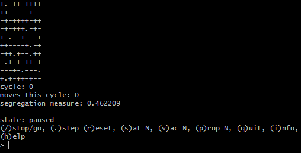
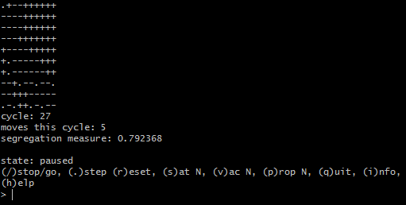

## Segregation

A C program written for Mechanics of Programming. Simulates the segregation of two different groups based on their preference to be either surrounded by those that are similar or surrounded by no one. The program will display an ASCII representation of a collection of units and empty spaces. The two different groups of units are denoted by the plus, '+', symbol and the minus, '-', symbol. Empty spaces are denoted by the period, '.', symbol. The program will also display an interactive prompt to step through the segregation process and change variables. Stepping through the segregation process will cause units to move based on their satisfaction. Satisfaction is given by the number of neighbors of the same group divided by the total number of neighbors. In the case that there are no neighbors satisfaction is 1. A unit will move if their satisfaction value is below the given satisfaction argument.

### Pre-Segregation Prompt:

### Post-Segregation Prompt:

